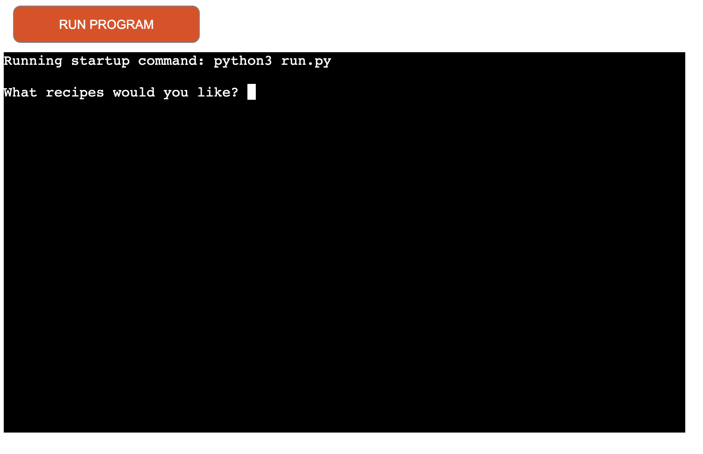
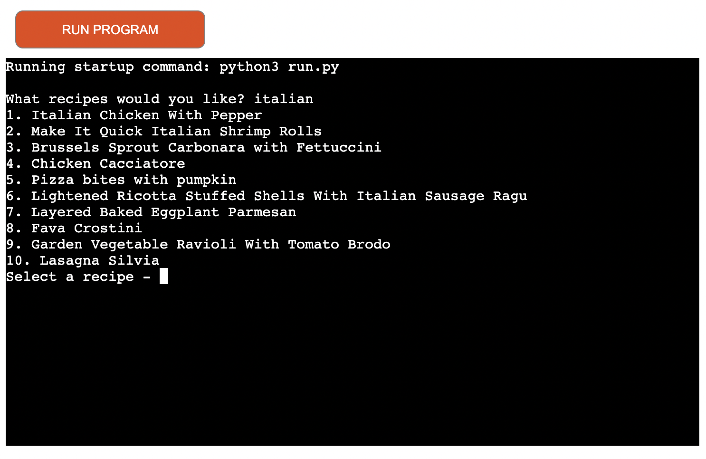
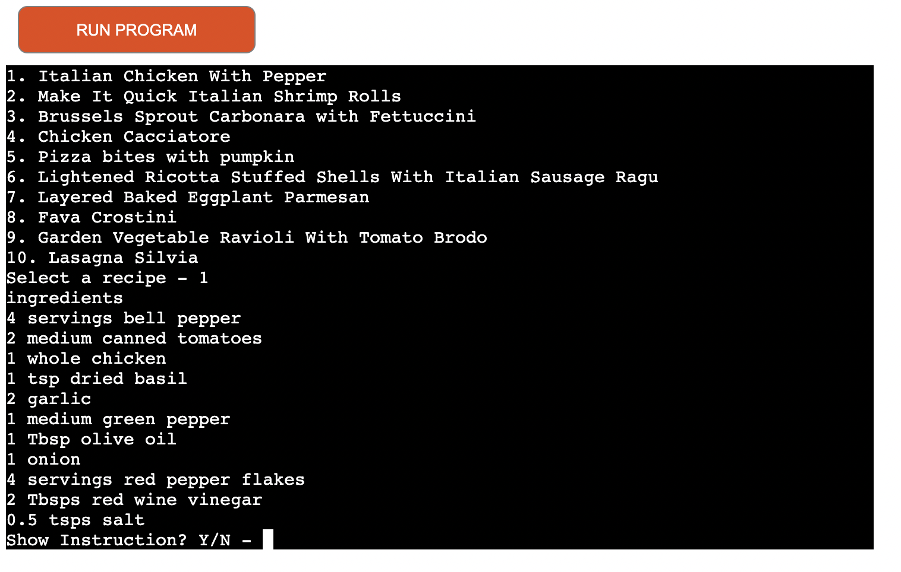
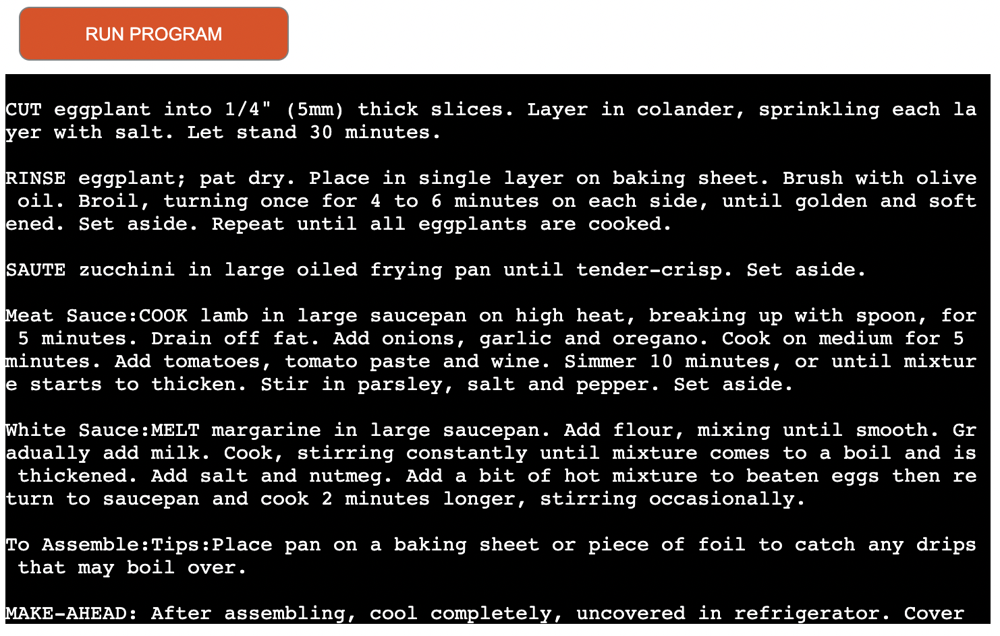
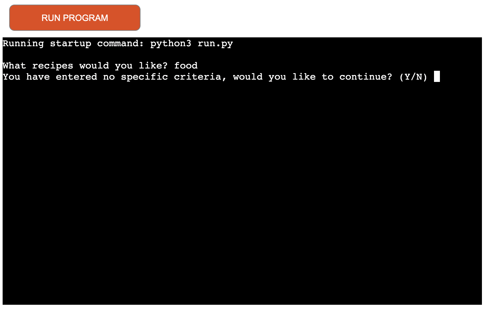
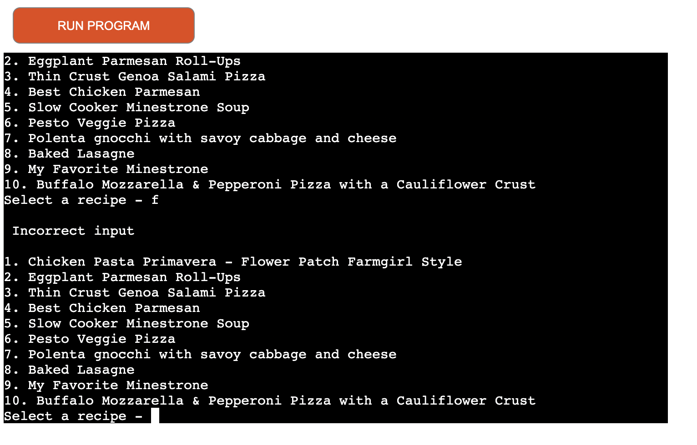
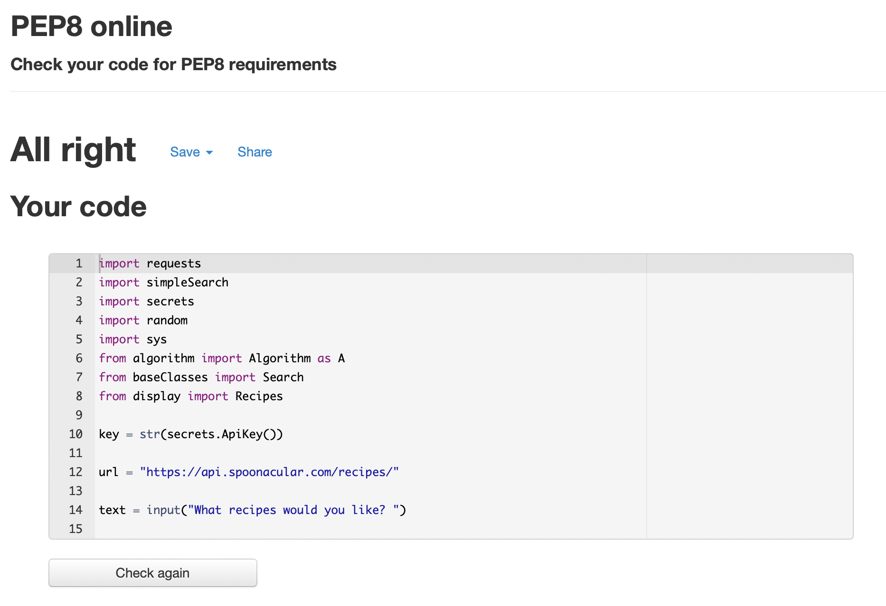

# Love recipes

## Welcome - [Love recipes](https://github.com/jamitag/Love-Recipes)
This terminal based programme is designed to produce a list of recipes based on the users preference. Interacting with an external database ([spoonacular](https://spoonacular.com/)), the user will receive a variation of recipes based upon their preferred cuisine and/or dietary requirements.

## How it works

Upon running the programme, the user is prompted to select the type of recipe they’re interested in e.g. “italian vegetarian”.

Using this combination of cuisines and/or dietary requirements, the API will return a list of ten recipes.

The resulting list of ten recipes is indexed and the user is further prompted to select a recipe by inputting the relevant number.

Once selected, the chosen recipe is displayed to the user and shown details including ingredients and quantities.

The user is further prompted to answer if they would like the view the instructions for chosen recipe. Answering ‘Y’ will display the steps to make the recipe. Answering ’N’ will restart the programme.

## Features

### Existing Features

- Randomly generated recipe list returned each time programme is called.

- Search items (currently only diet and cuisine types) maintained in classes which can be easily updated to allow enhanced scope of searching for further development.

- Extraction of specific data points from API determined to be of most interest to users. For future developments, searches can be further refined to pull data such as calories, equipment, nutritional data etc.

- Validation of user input.
	- When asked ‘What recipes would you like?’, If user inputs an invalid cuisine / diet they will receive the following message; ‘You have entered no specific criteria, would you like to continue? (Y/N)’. Answering ‘Y’ will return a random selection of recipes from available options. Answering ’N’ will end the programme.

    

	- If a user inputs an invalid response to ‘Select recipe’ (i.e. a letter or number not representing a recipe from the returned list), an “incorrect input” message is displayed to the user and the same list is then displayed for the user to try again and select a valid option.

    

- Instruction data manipulated to be displayed….

### Features to add

- Increase scope of search options for user e.g. additional cuisines and calorie counter.

- Have a ‘favourite recipe’ feature with allows the user to store their favourite recipes in a database which can be accessed any time.

- Display images of ingredients and recipes.

## User Experience (UX)

### User Stories

#### As a user

- I want a programme that returns recipes based on diet and/or cuisine I have inputted.
- I want a programme that prompts me to select or input data.
- I want a programme that tells me if I have made an error.
- I want a programme that delivers meaningful data from my selection and displays information in a user friendly way.

#### As a site owner

- I want the programme to interact efficiently with the API to deliver the user relevant data.

## Testing

### Manual Testing
- Input data that would throw an error to ensure correct response.
- Tested the programmes randomising feature to ensure a different 10 recipes appear after each api call.
- Input lower case response to check the upper method was functioning correctly.
- Asked friends to navigate through the programme to highlight any glitches or uncertain prompts.

### Validator Testing

All .py files were ran through <a href="http://pep8online.com">PEP8 linter</a>, with no problems detected.

## Bugs

Error - invalid url
Solution - Using the api documentation, copy and past correct format

Error - within url “number=id” required to produce number of results. Wouldn’t work until using ‘&’ after ’10’
Solution - Found solution within documentation

Error - Using the recommended ‘Pip3 freeze > requirements.txt’ command to populate requirements.txt did work as expected resulting in Heroku unable to display application. 
Solution - Copied requests file from the Love Sandwiches project which solved the issue.

Error - When testing the programme I noticed that there was an issue inputting certain types of cuisine. Sometimes when I input ‘british’ I will receive a list of recipes as expected and sometimes I will receive an error message. I was unable to solve this issue and may be a problem with the API itself.

## Technologies

- Python

- Heroku

- GitPod

- GitHub

- spoonacular api

## Deployment

This programme was deployed using [Heroku](https://heroku.com/)

1. Log into Heroku, select 'Create new app’.
2. Name your application then within the the dashboard, select settings and scroll down to ‘Reveal Config vars’
3. Enter relevant config vars, remembering to include any environmental variables you have in place. In this instance I included my creds.json file which contained my API key.
4. Then scroll to build pack section, and add ‘python’ and ‘node.js’ (in that order).
5. Navigate from ‘Settings’ to ‘Deploy’ and select ‘Github’ within the ‘Deployment Method’ section.
6. Search and connect your Github repo in the ‘Connect to Github’ section.
7. Clicking ‘Deploy branch’ will then create your Heroku app and you can view it by clicking the ‘View’ button at the bottom of the page.
	- Selecting ‘Enable Automatic Deploys’ will ensure that your Heroku app is updated each time you push changes from Gitpod otherwise you will have to deploy manually each time using the steps mentioned above.

## Credits

https://www.programiz.com/python-programming/methods/string/replace

Discovering the [replace method](https://www.programiz.com/python-programming/methods/string/replace) allowed me to convert certain float measurement into integers. Float values were useful for some ingredients (i.e 1.5 grams of sugar) but not suitable for others (I.e. 2.0 potatoes) therefore discovering the above solution allowed me to replace “.0” with “ ”, making the results more readable to the user.

I found this useful [tutorial](https://www.programiz.com/python-programming/exception-handling) on try statements in order to handle errors.

### Content
